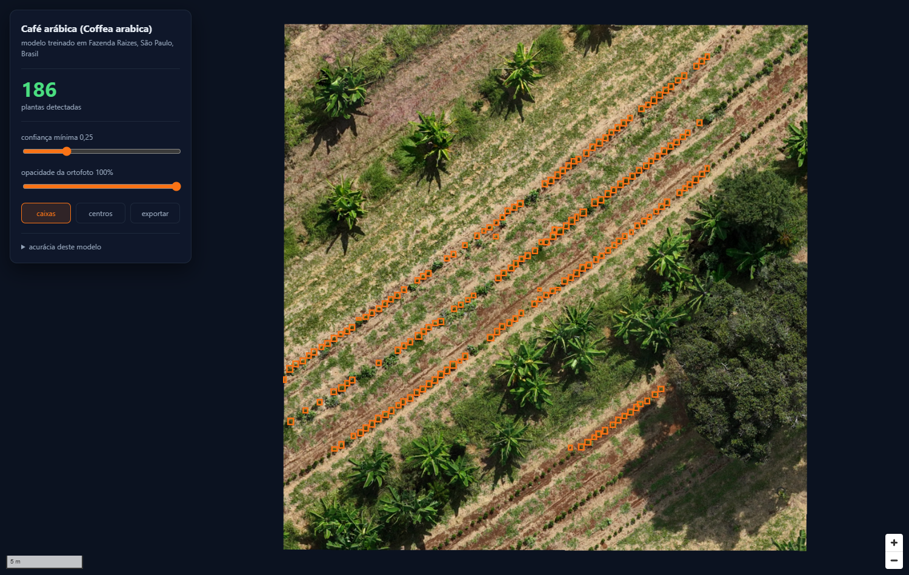

# Agroforestry inventory from drone imagery

Counts and locates individual plants in an agroforestry system from a drone
orthophoto. An image goes in; a map with every plant marked and a geographic file
for your GIS come out.



Runs on your own machine, without a GPU, without an account anywhere, and without
sending your imagery outside. Once the models are downloaded it works offline.

## Try it without installing anything

**[Open in Colab](https://colab.research.google.com/github/COURAGEOUS-LAND/agroforestry-inventory/blob/main/agroforestry_inventory_colab.ipynb)**
— pick a species, upload an orthophoto, get the map and the files. Free GPU, no
setup. Run it on the bundled example first to see what the output looks like.

## Run it locally

```bash
git clone https://github.com/COURAGEOUS-LAND/agroforestry-inventory
cd agroforestry-inventory

pip install -r requirements.txt
python download_models.py

python inventory.py example/coffee_raizes.tif --species coffee
```

The browser opens with the map. Use your own image the same way:

```bash
python inventory.py /path/to/my_orthophoto.tif --species banana
```

Needs Python 3.11+. The orthophoto must be a georeferenced GeoTIFF with at least
three bands (RGB).

### Output

| file | contents |
|---|---|
| `outputs/<name>_<species>_boxes.geojson` | one polygon per plant, with its confidence |
| `outputs/<name>_<species>_centroids.geojson` | the centre point of each plant |
| `outputs/<name>_<species>.csv` | the same as a table, with latitude and longitude |

All in EPSG:4326, ready for QGIS.

## Models

One model per species. The figures below were measured by comparing detections
against plants marked by hand, in areas the model never saw during training.

| species | `--species` | precision | recall | position error | median crown |
|---|---|---|---|---|---|
| Pitaya | `pitaya` | 0.89 | 0.98 | 7 cm | 0.97 m |
| Arabica coffee | `coffee` | 0.72 | 0.91 | 3 cm | 0.36 m |
| Avocado | `avocado` | 0.69 | 0.94 | 12 cm | 1.52 m |
| Banana | `banana` | 0.59 | 0.93 | 18 cm | 3.11 m |

**Precision** is how many of the reported plants are real. **Recall** is how many
of the real plants were found. Both matter, for different reasons: low precision
inflates the count, low recall hides plants.

Weights and full model cards: [huggingface.co/JefersonPMS/agroforestry-inventory](https://huggingface.co/JefersonPMS/agroforestry-inventory)

## Before trusting a number

**A model trained in one place loses accuracy in another, and the failure is
silent.** Flight altitude, time of day, season, plant age, soil, shading and
spacing all change how a crown looks. When a model does not suit your imagery, the
count still comes out confident — nothing in the output says otherwise.

So, on your own imagery:

1. Open the map and **look**. If the boxes do not sit on the plants, the model
   does not work there.
2. Count a small area by hand and compare.
3. Move the confidence slider. If the count collapses with a small increase, the
   detections are fragile.

Each model carries a `where_it_fails` field in [`models.json`](models.json),
saying what it gets wrong.

## How it works

Three stages, chained by `inventory.py` and also runnable on their own.

```
orthophoto.tif ──▶ ingest.py ──▶ detect.py ──▶ server.py ──▶ map in the browser
                      COG         GeoJSON      tiles + page
```

**`ingest.py`** converts the orthophoto to a Cloud Optimized GeoTIFF, so that
reading a piece of the image does not mean walking the whole file. Pyramid depth
is computed from the image size rather than fixed, so it keeps working at 4 GB.

**`detect.py`** walks the orthophoto in overlapping tiles, converts each predicted
box to geographic coordinates through the raster transform, and de-duplicates the
plants caught in more than one tile.

**`server.py`** serves the page and cuts every map tile from the COG on request,
which avoids generating an image pyramid on disk — over 600 MB for a 1.9 GB
orthophoto. Measured at 23–67 ms per new tile, 2 ms cached.

### Performance

Measured on a 1.9 GB orthophoto (27,426 × 21,800 px):

| | GPU (RTX 4070) | CPU only |
|---|---|---|
| per tile | 17 ms | 100 ms |
| whole orthophoto | ~1 min | **~4 min** |
| a 4 GB orthophoto | ~2 min | ~9 min |

A GPU helps but is not required.

### Options

```bash
python inventory.py image.tif --species coffee \
    --confidence 0.35 \   # minimum detection score (default 0.25)
    --dedup-m 0.4 \       # distance below which two detections are one plant
    --redo                # ignore previous results
```

`--dedup-m` defaults to the value recommended per species in the manifest. If you
change it, the rule of thumb is **half the smallest real spacing between plants**.
Too large a value merges neighbours and undercounts.

## Licence

Code under [GPL-3.0](LICENSE). Models under CC-BY-4.0.

Developed by Courageous Land. If this is useful in your research, citation
details are in [`CITATION.cff`](CITATION.cff).
